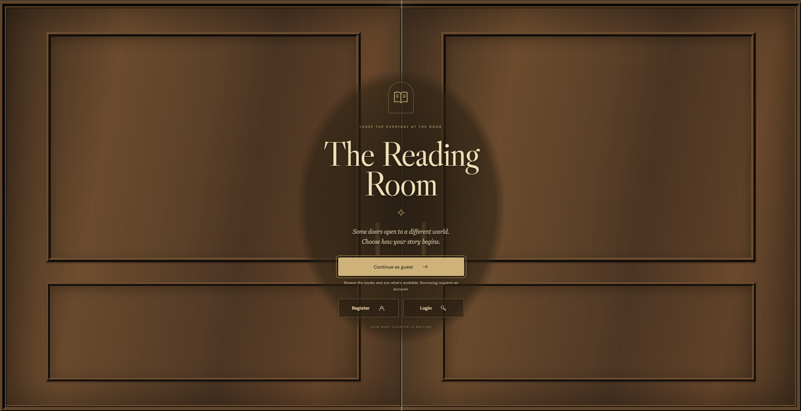
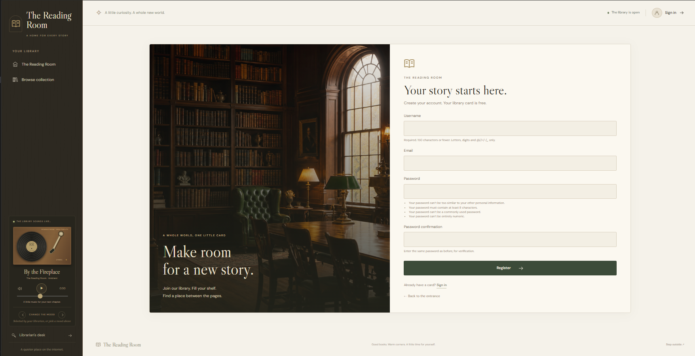
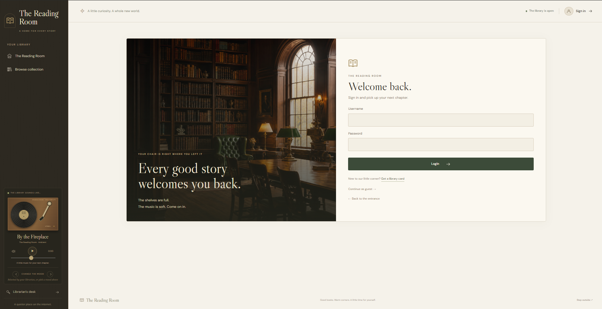
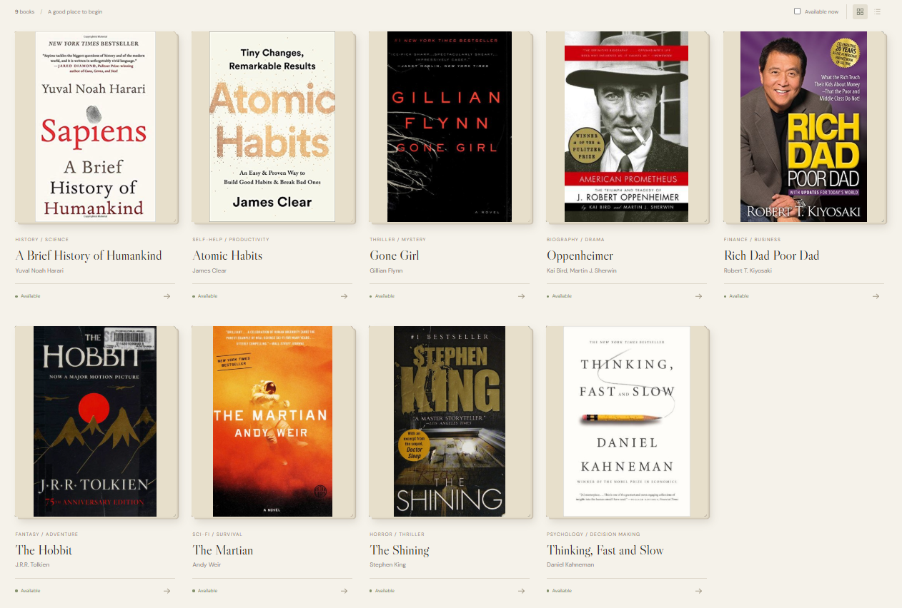
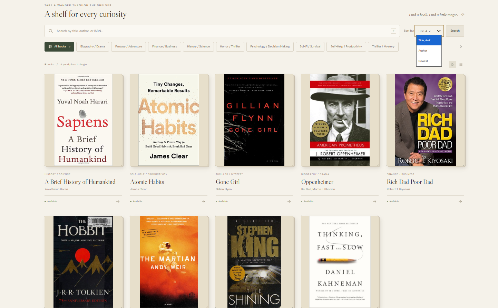
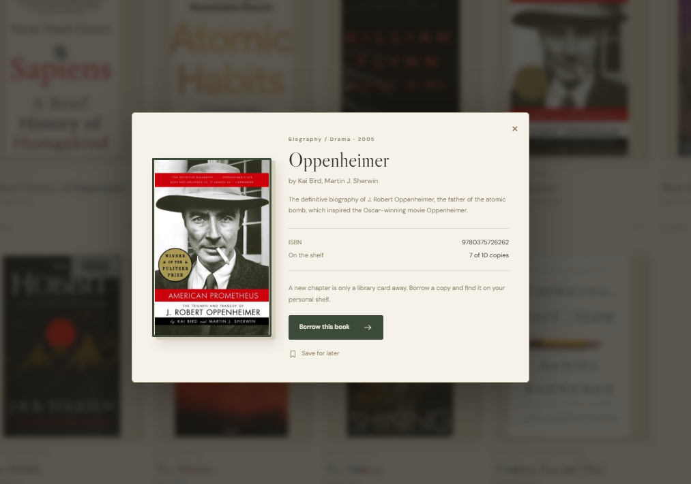
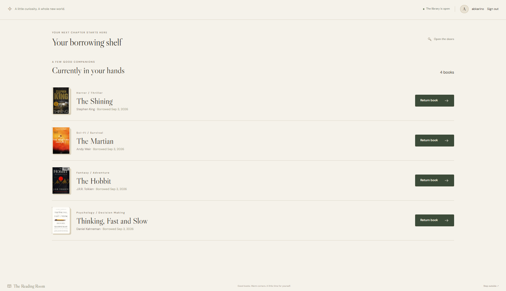
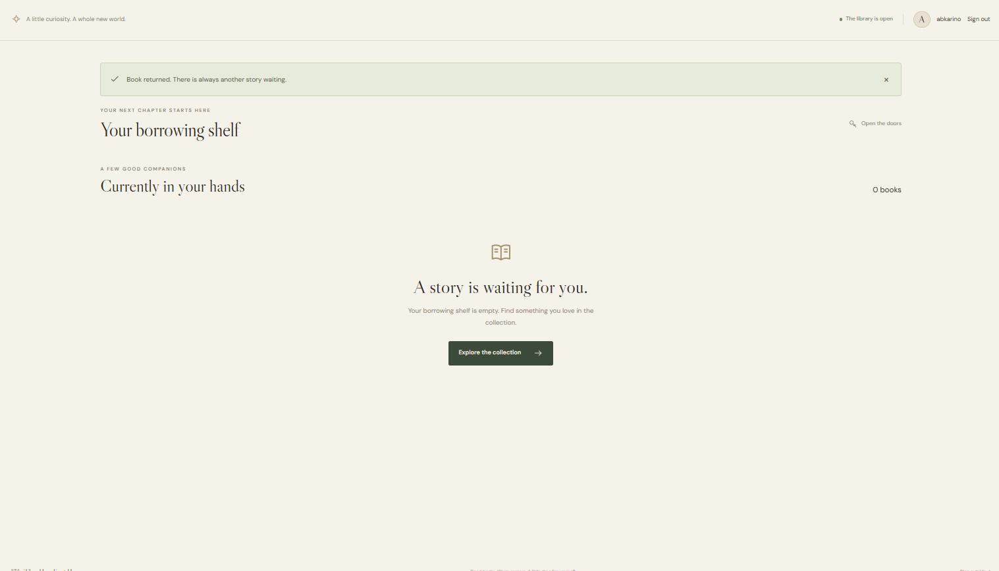
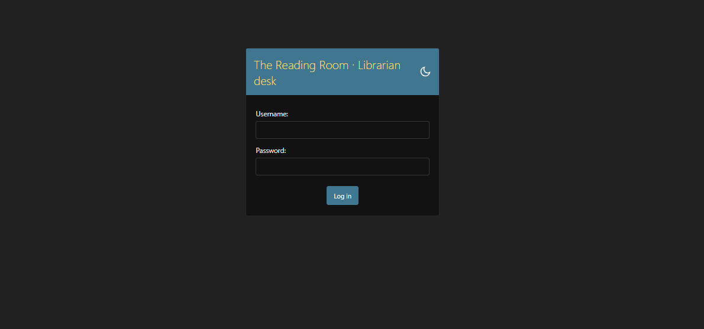
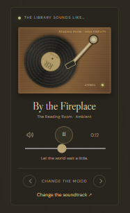

# 📚 The Reading Room — Library Management System

A modern Django-based Library Management System designed to provide a simple, interactive, and visually engaging experience for both library members and librarians.

The project combines Django's backend capabilities with HTML, CSS, and JavaScript to create a complete library workflow including authentication, book browsing, searching, borrowing, returning, and loan management.

---

## ✨ Project Overview

**The Reading Room** is a web-based Library Management System developed as a team project.

The system allows registered members to:

- Create a library account
- Log in and log out securely
- Browse the available book collection
- Search for books
- Filter books by category
- Sort books in different ways
- View detailed book information
- Borrow available books
- View their current borrowed books
- Return borrowed books
- Receive clear success and error messages

Librarians can manage the library's books and loans through Django's built-in administration interface.

The project also includes several additional interface and user-experience features such as book covers, an interactive library entrance, grid/list views, and an ambient audio player.

---

## 🎯 Project Goals

- Build a complete Django web application from scratch.
- Apply Object-Oriented Programming and Python concepts in a real project.
- Implement user authentication using Django's authentication system.
- Design and implement relational database models.
- Create a complete borrowing and returning workflow.
- Practice frontend development using HTML, CSS, and JavaScript.
- Implement client-side validation alongside server-side validation.
- Work collaboratively using Git and GitHub.
- Follow a structured development workflow from setup to testing and deployment-ready documentation.

---

## 🧩 Technologies Used

**Backend:** Python · Django · SQLite · Django Authentication · Django ORM · Django Admin

**Frontend:** HTML5 · CSS3 · JavaScript

**Development Tools:** Git · GitHub · Visual Studio Code

**External Integration:** Google Books API (for book cover functionality)

---

## 🏛️ Library Entrance

The application includes a dedicated library entrance experience before users enter the main collection, with options to sign in, register, or continue as a guest, plus an animated visual experience built around the library theme.



---

## 🔐 Authentication

### Registration

Users can create a new library account using a username, email, password, and password confirmation. The form includes client-side validation (required fields, email format, password match) alongside Django's server-side validation. After successful registration, the user is automatically logged in.



### 🔑 Login

Existing members can log in using Django's built-in authentication system. The system preserves the intended destination, so users continue to the requested page after logging in.



### 🚪 Logout

Authenticated users can safely log out of their account. After logout, the user is returned to the library entrance.

---

## 📚 Book Catalog

Authenticated members can browse the library's collection of books. Each book includes:

- Title
- Author
- ISBN
- Category
- Total copies
- Available copies
- Publication date

Books are managed through Django Admin.



---

## 🔎 Search & Filtering

Users can search books by title, author, or ISBN, and filter by category or availability. The catalog also supports sorting by title, author, or newest publications.



---

## 📖 Book Details

Users can open a book's details to view more information about it, including its current availability and cover image.



---

## 📚 Borrowing System

Members can borrow books directly from the catalog.

**Borrowing rules** — a member can borrow a book only when:

1. At least one copy is available.
2. The member does not already have the same book borrowed.

When a book is successfully borrowed:

- A new loan record is created.
- The book's available copy count decreases by one.
- The book appears in the member's active loans.
- A success message is displayed.

### 🚫 Preventing Invalid Borrowing

The system prevents users from borrowing the same book twice at the same time, and prevents borrowing when all copies are currently unavailable. Users receive clear feedback when a borrowing action cannot be completed, e.g.:

> All copies are currently borrowed. Please check back soon.

---

## 📋 My Loans

Authenticated members can access a dedicated **My Loans** section showing the books they currently have borrowed. Each active loan includes the book, borrow date, current loan status, and a return action.



---

## 🔄 Returning Books

When a book is returned:

- The loan status changes to `Returned`.
- The return date is recorded.
- The book's available copy count increases by one.
- The book is removed from the member's active loans.
- A success message is displayed.

A returned book can then be borrowed again if a copy is available.



---

## ⚙️ Django Admin

The project uses Django's built-in Admin interface for librarian management.

**Books:** add, edit, delete books · manage copy counts, categories, ISBNs, and publication dates

**Loans:** view loans, borrowing members, borrowed books, borrow/return dates, and loan status

No custom administration dashboard was required for the core project.



---

## 🎨 User Interface & Design

The application was designed around a classic library aesthetic combined with modern web interactions, using:

- Warm cream backgrounds
- Dark brown typography
- Olive accents
- Brass/gold details
- Serif display typography
- Modern sans-serif UI typography

### 🖥️ UI Features

- Responsive-style layout
- Book cards
- Grid/List view switching
- Interactive buttons & hover effects
- Animated library entrance
- Book detail dialogs
- Visual availability indicators
- Styled success/error messages
- Custom form styling
- Custom audio player
- Book cover presentation

---

## 🎵 Ambient Audio Player

The Reading Room includes an ambient audio player designed to enhance the library atmosphere. Available tracks:

- Cafe Corner
- Fireplace Crackle
- Night Garden
- Piano Waltz
- Rain Window



---

## 🗂️ Project Structure

```text
library_management_system/
│
├── accounts/
│   ├── migrations/
│   ├── static/
│   │   └── library/
│   │       ├── audio/
│   │       ├── images/
│   │       ├── cover-images.js
│   │       ├── favicon.svg
│   │       ├── library.css
│   │       └── library.js
│   │
│   ├── templates/
│   │   └── accounts/
│   │       ├── partials/
│   │       ├── base.html
│   │       ├── home.html
│   │       ├── login.html
│   │       └── register.html
│   │
│   ├── forms.py
│   ├── views.py
│   └── ...
│
├── catalog/
│   ├── migrations/
│   ├── models.py
│   └── ...
│
├── loans/
│   ├── migrations/
│   ├── models.py
│   ├── views.py
│   └── ...
│
├── manage.py
├── requirements.txt
├── README.md
└── DESIGN-README.md
```

---

## 🗄️ Database Models

### 📖 Book

- title
- author
- isbn (unique)
- category
- total_copies
- available_copies
- publication_date

### 📋 Loan

Connects a library member with a book.

- member
- book
- borrow_date
- return_date
- status (`Borrowed` / `Returned`)

The relationship between `User`, `Loan`, and `Book` allows the system to track which member currently has which book.

---

## 🔐 Authentication Architecture

The project uses Django's built-in authentication framework, relying on `User`, `login()`, `logout()`, `AuthenticationForm`, and `UserCreationForm` — a reliable server-side authentication mechanism without reinventing Django's authentication system.

---

## 🧠 Business Logic

The borrowing workflow was implemented with transaction-safe database operations.

**When borrowing a book, the system:**

1. Checks whether the member already has the book.
2. Checks whether an available copy exists.
3. Decreases the available copy count.
4. Creates the loan.
5. Shows the appropriate success/error message.

**When returning a book, the system:**

1. Verifies that the loan belongs to the logged-in member.
2. Confirms that the loan is currently active.
3. Changes the loan status to returned.
4. Records the return date.
5. Increases the available copy count.
6. Shows a success message.

---

## 🧪 Testing

The project was manually tested through the complete user workflow.

**Authentication:** register, validate required username/email/password, validate email format, detect password mismatch, login, logout

**Catalog:** browse, search by title/author/ISBN, filter by category/availability, sort books, view book details

**Borrowing:** borrow an available book, decrease available copies, create a loan, display in My Loans, prevent duplicate active borrowing, prevent borrowing when copies are unavailable

**Returning:** return an active loan, update loan status, record return date, increase available copies, remove from active loans, re-borrow after returning

**Interface:** navigation links, buttons, search controls, filters, grid/list view, book details dialog, audio player, browser console checked for JavaScript issues

---

## 🔄 Main User Flow

```
Library Entrance
      │
      ▼
Register / Login
      │
      ▼
Book Catalog ── Search ── Filter ── Sort ── View Details
      │
      ▼
   Borrow
      │
      ▼
  My Loans
      │
      ▼
   Return
      │
      ▼
Available Again
```

---

## 👨‍💻 Development Workflow

The project was developed using Git and GitHub for version control and team collaboration, organized into the following stages:

| Day | Focus |
|-----|-------|
| 1 | Setup & Planning — project setup, Git/GitHub init, Django structure, app planning |
| 2 | Core Models & Authentication — Book & Loan models, migrations, registration, login/logout |
| 3 | Borrow & Return — borrow/return functionality, availability validation, duplicate prevention |
| 4 | Frontend — library interface, catalog page, My Loans page, search, filtering, client-side validation |
| 5 | Integration — merged main features, fixed navigation, tested complete workflow |
| 6 | Testing & Polish — authentication/catalog/borrow/return testing, JS & console testing, UI polish |
| 7 | Documentation — README, project showcase, final testing, GitHub organization |

---

## 🌿 Git & GitHub

Git was used throughout the project to track changes and collaborate between team members.

**Repository:** https://github.com/AbdelazemAlaaEldin/library_management_system

---

## ⚙️ Installation

1. **Clone the repository**
   ```bash
   git clone https://github.com/AbdelazemAlaaEldin/library_management_system.git
   ```
2. **Enter the project directory**
   ```bash
   cd library_management_system
   ```
3. **Create a virtual environment**
   ```bash
   python -m venv .venv
   ```
4. **Activate the virtual environment**
   ```bash
   # Windows
   .venv\Scripts\activate

   # Git Bash
   source .venv/Scripts/activate
   ```
5. **Install dependencies**
   ```bash
   pip install -r requirements.txt
   ```
6. **Apply database migrations**
   ```bash
   python manage.py migrate
   ```
7. **Create a superuser**
   ```bash
   python manage.py createsuperuser
   ```
8. **Run the development server**
   ```bash
   python manage.py runserver
   ```
   Then open the local development server URL in your browser.

---

## 👨‍🏫 Django Admin

Access the administration panel at `/admin/` using the superuser account created during installation. From there, librarians can manage books and loans.

---

## 📋 Requirements

Project dependencies are listed in `requirements.txt`. The main framework used is **Django**.

---

## 🔮 Future Improvements

- Overdue fine calculation
- Due-date reminders
- Book reservations
- Custom librarian dashboard
- More advanced reporting
- Improved responsive layouts
- Expanded book metadata
- More advanced recommendation functionality

These features are outside the core requirements of the current project.

---

## 👥 Team Members

1. Abdelazem Alaa Eldin
2. Adel Alaa Ishak Tossa
3. Ahmed Mohamed Rabie Ali
4. Mohamed Mostafa Ali Mahmoud
5. Youssef Ayman Mohamed Medhat
6. Khaled Assem Abdelazim

---

## 📌 Project Status

**Status: Completed**

The core Library Management System workflow has been implemented and tested:

- ✅ Authentication
- ✅ Book Catalog
- ✅ Search & Filtering
- ✅ Borrowing
- ✅ My Loans
- ✅ Returning
- ✅ Django Admin
- ✅ Testing & Documentation

---

<p align="center"><i>📚 The Reading Room — A whole world, one little card.</i><br>
A library management system built with Django, designed to make discovering, borrowing, and returning books simple and enjoyable.</p>
